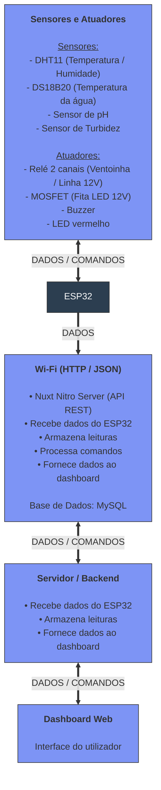

# Relatório Final - Projeto AquaSense

**Universidade:** IADE - Universidade Europeia

**Unidade Curricular:** PBL para 4 UC's (IoT, Sistemas Distribuidos, Engenharia de Software e IA)

**Grupo e ano Letivo:** Grupo 3 (2025/2026)

**Autores:** Rui Outeiro, Emanuel Carvalho, Paulo Jadaugy

- [Relatório Final - Projeto AquaSense](#relatório-final---projeto-aquasense)
  - [Introdução](#introdução)
  - [Problema](#problema)
  - [Solução Proposta](#solução-proposta)
  - [Estruturação da arquitetura](#estruturação-da-arquitetura)

## Identificação do Problema

Uma vez que não existe no mercado um sistema completo que permita acompanhar a qualidade da água em tempo real remotamente, nomeadamente parâmetros como pH, turbidez e temperatura e condições ambientais ao redor do aquário como temperatura e humidade.

Além disso, na aquariofilia, é preciso disciplina na manutenção dos aquários, pelo que podem existir momentos de desleixe porque requer muito trabalho. O objectivo aqui é automatizar parte desse trabalho como a monitorização de alguns dos parametros, a iluminação automática, etc.

As soluções atualmente disponíveis no mercado são limitadas, e não têm a capacidade de analise via Inteligência Artificial dos dados recolhidos para decisões operacionais. Além disso as poucas e limitadas ferramentas que existem são extremamente caras.

Devido a estas situações torna-se relevante desenvolver uma solução inteligente, acessível e inovadora que seja capaz de recolher dados, processar e analisar os dados da água em tempo real e que recorre a inteligência artificial para tomar decisões e emitir alertas para ajudar na manutenção dos aquários.

## Identificação de Requisitos

Foi elaborado um relatório com todos os requisitos funcionais/não funcionais que o sistema deve respeitar.

Desse documento destacamos as seguintes funcionalidades:

- **Sistema de iluminação inteligente**
  - Simulação de nascer e pôr do sol através de dimming (PWM), com fotoperíodo definido pelo utilizador na aplicação móvel.
  - Ajuste automático do fotoperíodo através de inteligência artificial, com base na claridade da água medida por um LDR que analisa a quantidade de luz que atravessa a coluna de água, permitindo detectar indiretamente a presença de algas e ajustar o fotoperíodo em conformidade.
  - Integração de uma API de meteorologia para adaptar o fotoperíodo às condições exteriores (ex: dias muito escuros, trovoadas, vagas de calor), aproximando o ciclo de luz no aquário das condições naturais. [pode ser desactivado pelo utilizador]

- **Conectividade e aplicação móvel**
  - Comunicação via wifi entre o ESP32 e o backend.
  - Aplicação móvel para:
    - Configuração do fotoperíodo.
    - Consultas em tempo real, e históricos de medições.
    - Receção de alertas e notificações com sugestões de acções a tomar perante as situações.

- **Monitorização contínua de parâmetros**
  - PH da água.
  - Temperatura da água.
  - Temperatura ambiente.

- **Alertas**
  - Notificações quando qualquer parâmetro sai dos intervalos definidos como seguros (PH, temperatura da água, temperatura ambiente, claridade anormal da água).

- **Arrefecimento automático**
  - Acionamento de uma ventoinha de arrefecimento quando a temperatura da água atinge ou ultrapassa os 30 °C, ajudando a manter o aquário dentro de uma faixa térmica segura.
 
[Link para o relatório](https://github.com/RuiOuteiro/AquaSense/blob/main/Documentacao/2aEntrega/Engenharia%20Software/Engenharia%20Software%20-%20Requisitos%20Funcionais_Nao%20Funcionais.pdf)

## Estruturação da arquitetura

    
### Camada de perceção/dispositivos

#### Hardware 

[Link do projeto](https://app.cirkitdesigner.com/project/a4304a47-1a98-431c-bca2-73c1af9060d3)

#### Software
#### Processamento de dados 
#### Conectividade 
#### Segurança

### Camada de rede 
#### Hardware 
#### Software
#### Conectividade 
#### Segurança
### Camada de processamento de dados
#### Hardware
#### Software
#### Processamento de dados
#### Conectividade
#### Segurança

### Camada de aplicação
#### Hardware 
#### Software
#### Processamento de dados 
#### Conectividade 
#### Segurança
