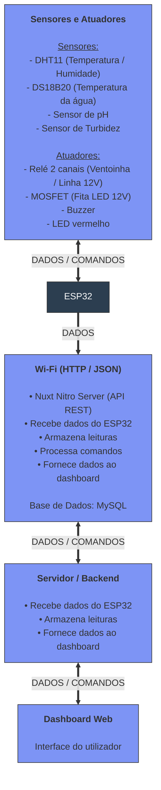

# Relatório Final - Projeto AquaSense

**Universidade:** IADE - Universidade Europeia

**Unidade Curricular:** PBL para 4 UC's (IoT, Sistemas Distribuidos, Engenharia de Software e IA)

**Grupo e ano Letivo:** Grupo 3 (2025/2026)

**Autores:** Rui Outeiro, Emanuel Carvalho, Paulo Jadaugy

- [Relatório Final - Projeto AquaSense](#relatório-final---projeto-aquasense)
  - [Introdução](#introdução)
  - [Problema](#problema)
  - [Solução Proposta](#solução-proposta)
  - [Estruturação da arquitetura](#estruturação-da-arquitetura)

## Identificação do Problema

Em muitos aquários, não existe um sistema acessível e autónomo que permita acompanhar a qualidade da água em tempo real, seja do trabalho ou de outro pais, nomeadamente parâmetros como pH, turbidez e temperatura.
Devido a ausência esta monotorização compromete o equilíbrio do ecossistema aquático e afeta a saúda dos organismos vivos e a deteção precoce de situações críticas.

As soluções atualmente disponíveis no mercado são limitadas, pouco integradas e sem capacidade de analise inteligente AI dos dados recolhidos e extremamente caras.
Devido a estas situações torna-se relevante desenvolver uma solução inteligente, acessível e inovadora que seja capaz de recolher dados, processar e analisar os dados da agua em tempo real e que recorre a inteligência artificial para tomar decisões emitir alertas ajudar na manutenção dos aquários 

## Solução Proposta

## Estruturação da arquitetura

    
### Camada de perceção/dispositivos

#### Hardware 

[Link do projeto](https://app.cirkitdesigner.com/project/a4304a47-1a98-431c-bca2-73c1af9060d3)

#### Software
#### Processamento de dados 
#### Conectividade 
#### Segurança

### Camada de rede 
#### Hardware 
#### Software
#### Conectividade 
#### Segurança
### Camada de processamento de dados
#### Hardware
#### Software
#### Processamento de dados
#### Conectividade
#### Segurança

### Camada de aplicação
#### Hardware 
#### Software
#### Processamento de dados 
#### Conectividade 
#### Segurança
