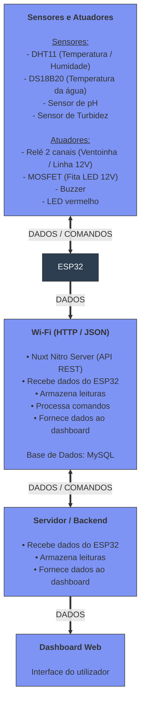

# Sistema para controlo de qualidade de um aquário - AquaSense

"PROPÓSITO"

**Autores:** Rui Outeiro, Emanuel Carvalho, Paulo Jadaugy

Estrutura exemplo

- Identificação do problema 
- Identificação de requisitos
- Estruturação da arquitetura 
  - Camada de perceção/dispositivos 
    - Hardware 
    - Software
    - Processamento de dados 
    - Conectividade 
    - Segurança
  - Camada de rede 
    - Hardware 
    - Software
    - Conectividade 
    - Segurança
  - Camada de processamento de dados
    - Hardware
    - Software
    - Processamento de dados
    - Conectividade
    - Segurança
  - Camada de aplicação
    - Hardware 
    - Software
    - Processamento de dados 
    - Conectividade 
    - Segurança
- Conclusão

## Introdução

## Problema

## Solução Proposta

## Estruturação da arquitetura

    
### Camada de perceção/dispositivos

#### Hardware 

#### Software
#### Processamento de dados 
#### Conectividade 
#### Segurança

### Camada de rede 
#### Hardware 
#### Software
#### Conectividade 
#### Segurança
### Camada de processamento de dados
#### Hardware
#### Software
#### Processamento de dados
#### Conectividade
#### Segurança

### Camada de aplicação
#### Hardware 
#### Software
#### Processamento de dados 
#### Conectividade 
#### Segurança
