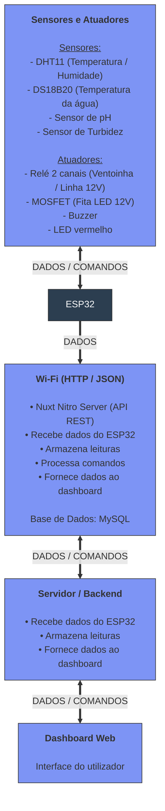

# Relatório Final - Projeto AquaSense

**Universidade:** IADE - Universidade Europeia

**Unidade Curricular:** PBL para 4 UC's (IoT, Sistemas Distribuidos, Engenharia de Software e IA)

**Grupo e ano Letivo:** Grupo 3 (2025/2026)

**Autores:** Rui Outeiro (20231566), Emanuel Carvalho (20231627), Paulo Jadaugy (20241711)

Índice:
- [Relatório Final - Projeto AquaSense](#relatório-final---projeto-aquasense)
  - [Introdução](#introdução)
  - [Problema](#problema)
  - [Solução Proposta](#solução-proposta)
  - [Estruturação da arquitetura](#estruturação-da-arquitetura)


## Identificação do Problema

Uma vez que não existe no mercado um sistema completo que permita acompanhar a qualidade da água em tempo real remotamente, nomeadamente parâmetros como pH, turbidez e temperatura e condições ambientais ao redor do aquário como temperatura e humidade.


Além disso, na aquariofilia, é preciso disciplina na manutenção dos aquários, pelo que podem existir momentos de desleixe porque requer muito trabalho. O objectivo aqui é automatizar parte desse trabalho como a monitorização de alguns dos parametros, a iluminação automática, etc.


As soluções atualmente disponíveis no mercado são limitadas, e não têm a capacidade de analise via Inteligência Artificial dos dados recolhidos para decisões operacionais. Além disso as poucas e limitadas ferramentas que existem são extremamente caras.


Devido a estas situações torna-se relevante desenvolver uma solução inteligente, acessível e inovadora que seja capaz de recolher dados, processar e analisar os dados da água em tempo real e que recorre a inteligência artificial para tomar decisões e emitir alertas para ajudar na manutenção dos aquários.

## Solução Proposta

O sistema Aquasense permite a monotorização continua e automática da qualidade da água do aquário, ao recolher dados de pH, turbidez e temperatura, estes são dados incompletos para uma análise completa da qualidade da água, mas permite ter uma ideia clara de alguns parametros chave.


O sistema é capaz de processar e analisar os dados em tempo real, permitido atuação automática e emissão de alertas em casos de condições críticas.


Permite acesso remoto à informação e permite a configuração do fotoperiodo e ventilação pelo utilizador e também recorre a inteligência artificial para apoiar a tomada de decisão e otimizar a manutenção do aquário.


## Identificação de Requisitos

Foi elaborado um relatório com todos os requisitos funcionais/não funcionais que o sistema deve respeitar.

Desse documento destacamos as seguintes funcionalidades:

- **Sistema de iluminação inteligente**
  - Simulação de nascer e pôr do sol através de dimming (PWM), com fotoperíodo definido pelo utilizador na aplicação móvel.
  - Ajuste automático do fotoperíodo através de inteligência artificial, com base na claridade da água medida por um LDR que analisa a quantidade de luz que atravessa a coluna de água, permitindo detectar indiretamente a presença de algas e ajustar o fotoperíodo em conformidade.
  - Integração de uma API de meteorologia para adaptar o fotoperíodo às condições exteriores (ex: dias muito escuros, trovoadas, vagas de calor), aproximando o ciclo de luz no aquário das condições naturais. [pode ser desactivado pelo utilizador]

- **Conectividade e aplicação móvel**
  - Comunicação via wifi entre o ESP32 e o backend.
  - Aplicação móvel para:
    - Configuração do fotoperíodo.
    - Consultas em tempo real, e históricos de medições.
    - Receção de alertas e notificações com sugestões de acções a tomar perante as situações.

- **Monitorização contínua de parâmetros**
  - PH da água.
  - Temperatura da água.
  - Temperatura ambiente.

- **Alertas**
  - Notificações quando qualquer parâmetro sai dos intervalos definidos como seguros (PH, temperatura da água, temperatura ambiente, claridade anormal da água).

- **Arrefecimento automático**
  - Acionamento de uma ventoinha de arrefecimento quando a temperatura da água atinge ou ultrapassa os 30 °C, ajudando a manter o aquário dentro de uma faixa térmica segura.
 
[Link para o relatório](https://github.com/RuiOuteiro/AquaSense/blob/main/Documentacao/2aEntrega/Engenharia%20Software/Engenharia%20Software%20-%20Requisitos%20Funcionais_Nao%20Funcionais.pdf)

## Estruturação da arquitetura


    
## Arquitetura por Camadas IoT

---

### 1. Camada de Perceção (Dispositivos)

Responsável pela recolha de dados do ambiente físico e atuação sobre o aquário.

#### Hardware


[Link do projeto no Cirkit Designer](https://app.cirkitdesigner.com/project/a4304a47-1a98-431c-bca2-73c1af9060d3)

**Ligações ao ESP32:**

| GPIO | Componente | Tipo | Função |
|------|------------|------|--------|
| GPIO 4 | DS18B20 | OneWire | Temperatura da água |
| GPIO 26 | DHT11 | Digital | Temperatura/humidade ambiente |
| GPIO 34 | Sensor pH | ADC | Leitura de pH |
| GPIO 35 | Sensor turbidez | ADC | Leitura de turbidez |
| GPIO 27 | Relé K1 | Digital | Ventoinha (ativo LOW) |
| GPIO 25 | LED vermelho | Digital | Indicador ventoinha |
| GPIO 33 | Buzzer passivo | PWM | Alerta sonoro |
| GPIO 21 | MOSFET | PWM | Luz principal 12V |
| GPIO 23 | Relé K2 | Digital | Luz noturna |

**Material:**

| Componente | Qtd | Notas |
|------------|-----|-------|
| ESP32 | 1 | Controlador principal |
| DS18B20 | 1 | Temp. água |
| DHT11 | 1 | Temp/humidade ambiente |
| Sensor pH + módulo | 1 | Leitura pH |
| Sensor turbidez | 1 | Leitura turbidez |
| Relé 2 canais | 1 | Ventoinha + luz noturna |
| MOSFET (IRLZ44N) | 1 | PWM LED 12V |
| Ventoinha 5V | 1 | Arrefecimento |
| Fita LED branca 12V | 5m | Iluminação principal |
| Fita LED azul 12V | 3m | Iluminação noturna |
| Fonte 12V + 5V | 2 | Alimentação |

#### Software (Firmware ESP32)

| Biblioteca | Função |
|------------|--------|
| WiFi.h | Conectividade WiFi |
| HTTPClient.h | Comunicação REST |
| ArduinoJson | Parsing JSON |
| OneWire + DallasTemperature | Sensor DS18B20 |
| DHT | Sensor DHT11 |
| time.h | Sincronização NTP |
| LEDC | Controlo PWM |

#### Processamento
- Leitura periódica dos sensores (temperatura, pH, turbidez, humidade)
- Controlo automático da ventoinha por temperatura
- Controlo de iluminação por horário/modo com fade PWM
- Envio de dados em batch via HTTP POST (JSON)

#### Segurança
- Validação de leituras antes do envio
- Reconexão automática WiFi
- Timeout em requests HTTP

---

### 2. Camada de Rede (Conectividade)

Responsável pela comunicação entre dispositivos e servidor.

#### Protocolo
- **WiFi 2.4GHz** - Ligação do ESP32 à rede local
- **HTTP/REST** - Comunicação ESP32 ↔ Backend
- **JSON** - Formato de dados

#### Fluxo de Dados
```
ESP32 → HTTP POST /api/sensors → Nitro Backend → MySQL
ESP32 ← HTTP GET /api/config/esp32 ← Nitro Backend ← MySQL
```

#### Endpoints Principais

| Método | Endpoint | Função |
|--------|----------|--------|
| POST | `/api/sensors` | Receber dados dos sensores |
| GET | `/api/config/esp32` | Enviar configurações ao ESP32 |
| GET/PUT | `/api/config` | Configurações do dashboard |
| GET/PUT | `/api/alertas/config` | Configuração de alertas |
| POST | `/api/auth/login` | Autenticação |

#### Segurança
- JWT para autenticação de utilizadores
- Cookies HTTP-only para sessões
- CORS configurado

---

### 3. Camada de Processamento (Backend + IA)

Responsável pelo armazenamento, processamento e análise inteligente dos dados.

#### Backend (Nitro/Nuxt)

| Componente | Tecnologia | Função |
|------------|------------|--------|
| Runtime | Node.js | Execução |
| Framework | Nuxt 4 / Nitro | API REST |
| Base de Dados | MySQL | Persistência |
| Auth | JWT + bcrypt | Autenticação |

#### Inteligência Artificial

| Componente | Tecnologia | Função |
|------------|------------|--------|
| Rede Neural | PyTorch | Modelo preditivo |
| API Server | Flask | Exposição REST |
| Preprocessing | scikit-learn | Normalização dados |

**Endpoints IA:**

| Endpoint | Função |
|----------|--------|
| GET `/api/ai/health` | Status do modelo |
| GET `/api/ai/photoperiod` | Sugestão de fotoperíodo |
| POST `/api/ai/apply` | Aplicar sugestão |

#### Processamento
- Armazenamento de leituras históricas
- Cálculo de médias e estatísticas
- Verificação de limites e geração de alertas
- Inferência do modelo neural para sugestões

#### Segurança
- Passwords com hash bcrypt (salt 10)
- Tokens JWT com expiração
- Validação de inputs em todos os endpoints

---

### 4. Camada de Aplicação (Frontend)

Responsável pela interface com o utilizador.

#### Tecnologias

| Componente | Tecnologia |
|------------|------------|
| Framework | Nuxt 4 + Vue 3 |
| Styling | CSS custom |
| Icons | Material Icons |
| Fonts | Inter, JetBrains Mono |

#### Funcionalidades
- Dashboard em tempo real com gráficos
- Configuração de fotoperíodo e ventilação
- Gestão de alertas e notificações
- Histórico de leituras
- Sugestões de IA
- Perfil de utilizador

#### Integrações

| Serviço | Função |
|---------|--------|
| Telegram Bot API | Notificações de alertas |

#### Segurança
- Autenticação obrigatória
- Sessões com cookies seguros
- Logout automático

---

## Ferramentas de Desenvolvimento

| Ferramenta | Uso |
|------------|-----|
| VS Code | IDE principal |
| Arduino IDE | Firmware ESP32 |
| Node.js | Runtime web |
| GitHub | Controlo de versões |
| XAMPP | MySQL local |
| Draw.io | Diagramas |
| Cirkit Designer | Esquemas elétricos |
