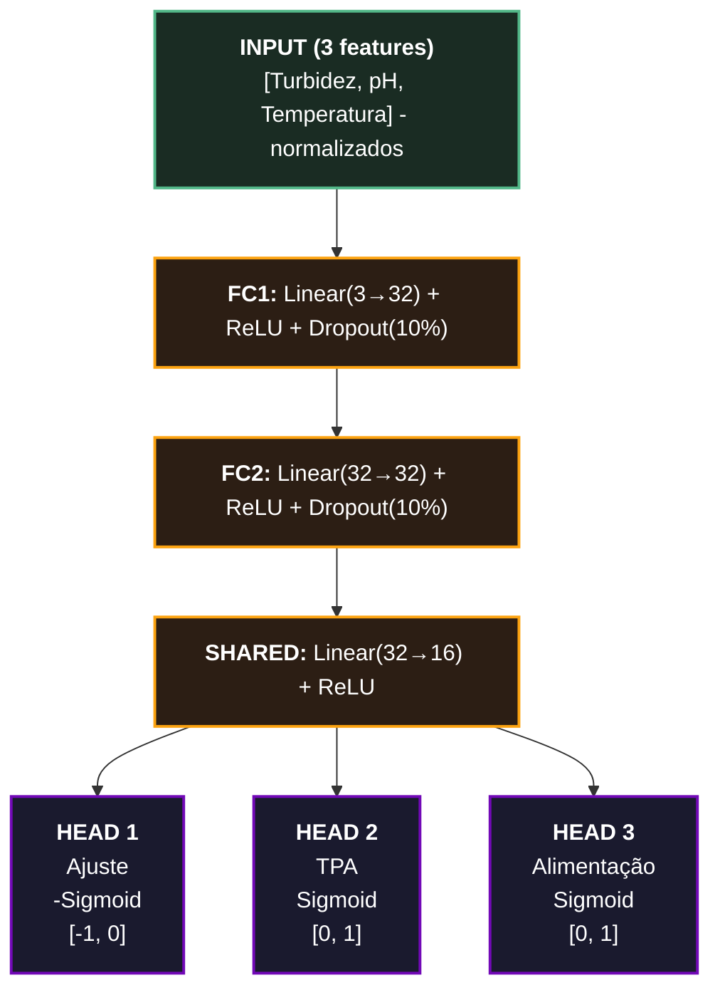

# Sistema de Inteligência Artificial AquaSense

Relatório Técnico-Académico Completo

Rede Neural Multi-Output para Optimização Automática de Aquários

**Autores:** Rui Outeiro, Emanuel Carvalho, Paulo Jadaugy

**Data:** Fevereiro 2026

**Versão:** 1.0.0

## Índice

1.  [1\. Introdução](#sec1)
2.  [2\. Fundamentos de Redes Neurais](#sec2)
    1.  [2.1 Neurónio Artificial](#sec2-1)
    2.  [2.2 Camadas Lineares](#sec2-2)
    3.  [2.3 Funções de Activação (ReLU, Sigmoid)](#sec2-3)
    4.  [2.4 Backpropagation](#sec2-4)
3.  [3\. Arquitectura PhotoperiodNet](#sec3)
4.  [4\. Dados e Treino](#sec4)
5.  [5\. Optimização (Adam, Loss)](#sec5)
6.  [6\. Métricas de Avaliação](#sec6)
7.  [7\. Resultados](#sec7)
8.  [8\. Conclusões](#sec8)

## 1. Introdução

O módulo de IA do AquaSense foi desenvolvido para **optimizar automaticamente as condições do aquário** através da análise de dados de sensores em tempo real. O sistema recebe três entradas (turbidez, pH, temperatura) e produz três saídas accionáveis (ajuste de fotoperíodo, TPA recomendada, ajuste de alimentação).

### Problema

Utilizadores sem experiência enfrentam dificuldades em correlacionar múltiplos parâmetros interdependentes. A turbidez elevada pode indicar excesso de luz (algas), mas também excesso de alimentação ou necessidade de TPA. A IA resolve este problema analisando todos os parâmetros simultaneamente.

### Solução Proposta

Uma **rede neural multi-output** treinada com dados sintéticos baseados em regras de aquariofilia. O modelo aprende relações não-lineares entre os parâmetros e generaliza para cenários não vistos durante o treino.

| Entrada | Intervalo | Descrição |
| --- | --- | --- |
| Turbidez | 0-100% | Claridade da água (0 = cristalina) |
| pH  | 6.0-8.5 | Acidez/alcalinidade |
| Temperatura | 20-31°C | Temperatura da água |

| Saída | Intervalo | Descrição |
| --- | --- | --- |
| Ajuste Fotoperíodo | \-12 a 0h | Redução de horas de luz |
| TPA | 0-100% | Troca parcial de água recomendada |
| Alimentação | 0-100% | Percentagem da alimentação normal |

## 2. Fundamentos Teóricos de Redes Neurais

### 2.1 Neurónio Artificial

O **neurónio artificial** (perceptrão) é a unidade básica das redes neurais. Inspirado no neurónio biológico, realiza uma soma ponderada das entradas, adiciona um bias e aplica uma função de activação.

> [!NOTE]
> <div align="center">
>
> **Equação do Neurónio**
>
> $$y = f(\sum w_i x_i + b) = f(w^T x + b)$$
> </div>
>
> **Onde:** y = saída, xi = entradas, wi = pesos, b = bias, f = função de activação

### 2.2 Camadas Lineares (Fully Connected)

Uma **camada linear** (ou _dense layer_) é uma transformação afim que mapeia um vector de entrada para um vector de saída através de uma matriz de pesos W e um vector de bias b.

> [!NOTE]
> <div align="center">
>
> **Transformação Linear**
>
> $$z = Wx + b$$
> </div>
>
> **Onde:** z ∈ ℝm = saída, W ∈ ℝm×n = matriz de pesos, x ∈ ℝn = entrada, b ∈ ℝm = bias  
> **Parâmetros treináveis:** m × n + m = m(n + 1)

**Exemplo:** A primeira camada do PhotoperiodNet é `Linear(3, 32)`, com 3×32 + 32 = **128 parâmetros**.

### 2.3 Funções de Activação

As funções de activação introduzem **não-linearidade**, permitindo que a rede aprenda relações complexas. Sem elas, múltiplas camadas lineares seriam equivalentes a uma única transformação linear.

#### 2.3.1 ReLU (Rectified Linear Unit)

A função **ReLU** é a activação mais usada em camadas ocultas devido à sua simplicidade e eficácia.

> [!NOTE]
> <div align="center">
>
> **FUNÇÃO RELU**
>
> $$\text{ReLU}(x) = \max(0, x) = \begin{cases} x, & \text{se } x > 0 \\ 0, & \text{se } x \leq 0 \end{cases}$$
>
> </div>
>
> **Domínio:** $\mathbb{R}$ | **Imagem:** $[0, +\infty)$
>
> **Derivada:** $f'(x) = 1$ se $x > 0$, $f'(x) = 0$ se $x \leq 0$


> [!NOTE]
> <div align="center">
>
>
> **DERIVADA DA RELU**
>
> $$\frac{d}{dx} \text{ReLU}(x) = \begin{cases} 1, & \text{se } x > 0 \\ 0, & \text{se } x \leq 0 \end{cases}$$
> 
> </div>
>
> A derivada simples ($0$ ou $1$) evita o *vanishing gradient problem* que afecta sigmoid/tanh em redes profundas.

##### Vantagens da ReLU:

*   **Esparsidade:** Neurónios negativos = 0, criando representações esparsas eficientes
*   **Gradiente não saturante:** Para x > 0, gradiente = 1 (treino mais rápido)
*   **Computacionalmente eficiente:** Apenas uma comparação (vs. exponenciais na sigmoid)
*   **Convergência 6x mais rápida** que tanh (Krizhevsky et al., 2012)

##### Desvantagens:

*   **Dying ReLU:** Neurónios com entrada sempre negativa "morrem" (gradiente = 0 permanente)
*   **Não centrada em zero:** Saídas ≥ 0 podem causar zig-zagging na optimização

#### 2.3.2 Função Sigmoid

A **sigmoid** mapeia valores para (0, 1), ideal para probabilidades ou valores normalizados.


> [!NOTE]
> <div align="center">
>
> **FUNÇÃO SIGMOID (LOGÍSTICA)**
>
> $$\sigma(x) = \frac{1}{1 + e^{-x}}$$
>
>  </div>
>
> **Domínio:** $\mathbb{R}$ | **Imagem:** $(0, 1)$
>
> $\sigma(0) = 0.5$ | $\lim_{x \to +\infty} \sigma(x) = 1$ | $\lim_{x \to -\infty} \sigma(x) = 0$
>
> ---
>
> <div align="center">
>
> **DERIVADA DA SIGMOID**
>
> $$\sigma'(x) = \sigma(x) \cdot (1 - \sigma(x))$$
>
> </div>
>
> Derivada máxima $= 0.25$ (quando $x = 0$). Este valor pequeno causa *vanishing gradient* em redes profundas, por isso usamos sigmoid apenas nas saídas.

##### Uso no PhotoperiodNet:

*   **Ajuste:** `-sigmoid(x)` → \[-1, 0\] × 12 = \[-12h, 0h\]
*   **TPA:** `sigmoid(x)` → \[0, 1\] × 100 = \[0%, 100%\]
*   **Alimentação:** `sigmoid(x)` → \[0, 1\] × 100 = \[0%, 100%\]

#### 2.3.3 Comparação de Funções de Activação

| Função | Fórmula | Intervalo | Derivada | Uso |
| --- | --- | --- | --- | --- |
| **ReLU** | max(0, x) | \[0, +∞) | 0 ou 1 | Camadas ocultas |
| **Sigmoid** | 1/(1+e\-x) | (0, 1) | σ(1-σ) | Saídas normalizadas |
| Tanh | (ex\-e\-x)/(ex+e\-x) | (-1, 1) | 1-tanh² | RNNs |
| Leaky ReLU | max(αx, x) | ℝ   | α ou 1 | Evitar dying ReLU |
| Softmax | exi/Σexj | (0,1), Σ=1 | complexa | Classificação |

### 2.4 Backpropagation e Gradiente Descendente

O **backpropagation** calcula gradientes da loss em relação aos pesos, propagando o erro da saída para as camadas anteriores usando a regra da cadeia.

> [!NOTE]
> <div align="center">
>
> **REGRA DA CADEIA**
>
>  $$\frac{\partial L}{\partial w} = \frac{\partial L}{\partial z} \cdot \frac{\partial z}{\partial w}$$
>
> </div>
>
> O gradiente de $L$ em relação a $w$ é o produto dos gradientes ao longo do caminho computacional.

> [!NOTE]
> <div align="center">
>
> **ACTUALIZAÇÃO DE PESOS (GRADIENT DESCENT)**
>
>  $$w_{t+1} = w_t - \eta \cdot \frac{\partial L}{\partial w_t}$$
>
> </div>
>
> **$\eta$ (eta):** *learning rate* (taxa de aprendizagem)
>
> Se gradiente $> 0$, diminuímos $w$. Se gradiente $< 0$, aumentamos $w$.

#### Variantes do Gradient Descent

| Variante | Batch | Características |
| --- | --- | --- |
| Batch GD | Todo o dataset | Estável mas lento |
| SGD | 1 amostra | Rápido mas ruidoso |
| **Mini-batch** | n amostras (32) | Equilíbrio - **usado no PhotoperiodNet** |

## 3. Arquitectura do Modelo PhotoperiodNet




### Detalhes das Camadas

| Camada | Tipo | Entrada→Saída | Activação | Parâmetros |
| --- | --- | --- | --- | --- |
| fc1 | Linear | 3→32 | ReLU | 128 |
| dropout1 | Dropout(0.1) | 32→32 | \-  | 0   |
| fc2 | Linear | 32→32 | ReLU | 1,056 |
| dropout2 | Dropout(0.1) | 32→32 | \-  | 0   |
| shared | Linear | 32→16 | ReLU | 528 |
| head\_adj | Linear | 16→1 | \-Sigmoid | 17  |
| head\_tpa | Linear | 16→1 | Sigmoid | 17  |
| head\_feed | Linear | 16→1 | Sigmoid | 17  |
| **Total** |     |     |     | **1,763** |

### Dropout como Regularização

> [!NOTE]
> <div align="center">
>
> **DROPOUT**
>
> $$h_{drop} = \frac{m \cdot h}{1 - p}$$
>
> </div>
> **m:** máscara binária (Bernoulli) | **p = 0.1:** probabilidade de desactivar
> 
> Durante treino: 10% dos neurónios são zerados aleatoriamente
> 
> Durante inferência: todos os neurónios activos

### Multi-Head Output

As três "cabeças" partilham a representação aprendida pelas camadas ocultas, mas especializam-se cada uma na sua tarefa. Isto é mais eficiente que três modelos separados e permite _transfer learning_ implícito entre tarefas relacionadas.

## 4. Dados e Processo de Treino

### 4.1 Geração de Dados Sintéticos

O modelo foi treinado com **10.000 amostras sintéticas** geradas por regras especializadas de aquariofilia.

#### Distribuições das Features

> [!NOTE]
> <div align="center">
>
> **TURBIDEZ: BETA(2, 5) × 100**
>
> $$f(x; \alpha=2, \beta=5) = \frac{x^{\alpha-1}(1-x)^{\beta-1}}{B(\alpha, \beta)}$$
> </div>
> 
> **Média:** $2/7 \approx 28.6\%$ | **Moda:** $20\%$
>
> Maioria das amostras em valores baixos (água limpa) - realista para aquários bem mantidos.

> [!NOTE]
> <div align="center">
>
> **PH: NORMAL(7.0, 0.4), TRUNCADA [6.0, 8.5]**
>
> $$f(x; \mu=7, \sigma=0.4) = \frac{1}{\sigma\sqrt{2\pi}} \cdot e^{-\frac{(x-\mu)^2}{2\sigma^2}}$$
> </div>
> 
> Distribuição centrada no pH neutro ($7.0$), típico de água de aquário.

> [!NOTE]
> <div align="center">
>
> **TEMPERATURA: NORMAL(25.5, 2.0), TRUNCADA [20, 31]**
>
> $$f(x; \mu=25.5, \sigma=2) \text{ - temperatura típica de aquário tropical}$$
> </div>
>
> **Média:** $25.5$°C | **Desvio Padrão:** $2.0$

### 4.2 Regras Base (Ground Truth)

Os labels são gerados por regras especializadas. A turbidez é o driver principal:

| Turbidez | Nível | Ajuste Luz | TPA | Alimentação |
| --- | --- | --- | --- | --- |
| 0-20% | Normal | 0h  | 15% | 100% |
| 20-40% | Baixo | \-1 a -3h | 20-30% | 100% |
| 40-60% | Moderado | \-3 a -5h | 30-50% | 75% |
| 60-80% | Alto | \-5 a -8h | 50-70% | 50% |
| 80-100% | Crítico | \-8 a -10h | 70-80% | 0%  |

**pH e Temperatura** actuam como multiplicadores de risco quando fora dos intervalos ideais (pH 6.8-7.2, Temp 22-28°C).

### 4.3 Normalização (StandardScaler)

> [!NOTE]
> <div align="center">
>
> **Z-SCORE NORMALIZATION**
>
> $$x_{norm} = \frac{x - \mu}{\sigma}$$
> </div>
>
> **$\mu$:** média do conjunto de treino | **$\sigma$:** desvio padrão
> **Importante:** O scaler é ajustado apenas nos dados de treino e guardado em `models/scaler.pkl`

### 4.4 Divisão Train/Test

*   **80% Treino:** 8,000 amostras
*   **20% Teste:** 2,000 amostras (nunca vistas durante treino)
*   **Seed fixa:** 42 (reprodutibilidade)

## 5. Optimização e Treino

### 5.1 Função de Perda: MSE

> [!NOTE]
> <div align="center">
>
> **MEAN SQUARED ERROR (MSE)**
>
> $$\text{MSE} = \frac{1}{n} \sum_{i=1}^{n} (y_i - \hat{y}_i)^2$$
> </div>
>
> Média dos quadrados das diferenças entre valores reais ($y$) e previsões ($\hat{y}$).
> 
> Penaliza mais erros grandes devido ao quadrado.

### 5.2 Optimizador Adam

**Adam** (Adaptive Moment Estimation) é um algoritmo de optimização estocástica proposto por Kingma & Ba (2014). Combina as vantagens do **SGD com Momentum** (que acelera a convergência em direcções consistentes) e do **RMSprop** (que adapta a learning rate por parâmetro).

> [!NOTE]
> <div align="center">
>
> **Definição Formal: Adam**
>
> </div>
>
> Adam mantém estimativas de médias móveis exponenciais do primeiro momento (média) e do segundo momento (variância não centrada) dos gradientes, usando estas estimativas para adaptar a taxa de aprendizagem de cada parâmetro individualmente.

#### 5.2.1 Motivação e Contexto Histórico

Antes do Adam, os optimizadores tinham limitações específicas:

*   **SGD:** Learning rate fixa para todos os parâmetros; convergência lenta em superfícies com curvatura variável
*   **SGD + Momentum:** Acelera convergência mas não adapta por parâmetro
*   **AdaGrad:** Adapta LR por parâmetro mas acumula gradientes indefinidamente, causando LR→0
*   **RMSprop:** Resolve AdaGrad com média móvel, mas sem momentum

O **Adam** unifica estas técnicas, sendo robusto a hiperparâmetros e eficiente em memória.

#### 5.2.2 Algoritmo Completo

> [!NOTE]
> <div align="center">
>
> **ALGORITMO: ADAM (ADAPTIVE MOMENT ESTIMATION)**
> </div>
>
> 1. **Entrada:** $\alpha$ (*learning rate*), $\beta_1, \beta_2$ (taxas de decaimento), $\epsilon$ (estabilidade), $\theta_0$ (parâmetros iniciais)
> 2. **Inicializar:** $m_0 = 0$ ($1º$ momento), $v_0 = 0$ ($2º$ momento), $t = 0$
> 3. **Repetir até convergência:**
>    * $t \leftarrow t + 1$
>    * $g_t \leftarrow \nabla_{\theta} L(\theta_{t-1})$ (calcular gradiente)
>    * $m_t \leftarrow \beta_1 \cdot m_{t-1} + (1 - \beta_1) \cdot g_t$ (actualizar $1º$ momento)
>    * $v_t \leftarrow \beta_2 \cdot v_{t-1} + (1 - \beta_2) \cdot g_t^2$ (actualizar $2º$ momento)
>    * $\hat{m}_t \leftarrow m_t / (1 - \beta_1^t)$ (correcção de bias $1º$ momento)
>    * $\hat{v}_t \leftarrow v_t / (1 - \beta_2^t)$ (correcção de bias $2º$ momento)
>    * $\theta_t \leftarrow \theta_{t-1} - \alpha \cdot \hat{m}_t / (\sqrt{\hat{v}_t} + \epsilon)$ (actualizar parâmetros)
> 4. **Retornar:** $\theta_t$ (parâmetros optimizados)

#### 5.2.3 Fórmulas Matemáticas Detalhadas

> [!NOTE]
> <div align="center">
>
> **PASSO 1: CÁLCULO DO GRADIENTE**
>
> $$g_t = \nabla_{\theta} L(\theta_{t-1}) = \partial L / \partial \theta$$
> </div>
>
> O gradiente $g_t$ é o vector de derivadas parciais da função de perda $L$.
>
> ---
> <div align="center">
>
> **PASSO 2: ACTUALIZAÇÃO DO PRIMEIRO MOMENTO (MÉDIA)**
>
> $$m_t = \beta_1 \cdot m_{t-1} + (1 - \beta_1) \cdot g_t$$
> </div>
>
> **$\beta_1 = 0.9$:** Suaviza oscilações e acelera em direcções consistentes (*momentum*).
>
> ---
> <div align="center">
>
> **PASSO 3: ACTUALIZAÇÃO DO SEGUNDO MOMENTO (VARIÂNCIA)**
>
> $$v_t = \beta_2 \cdot v_{t-1} + (1 - \beta_2) \cdot g_t^2$$
> </div>
>
> **$\beta_2 = 0.999$:** Mede a "magnitude histórica" dos gradientes para cada parâmetro.
>
> ---
> <div align="center">
> 
> **PASSO 4: CORRECÇÃO DE BIAS (BIAS CORRECTION)**
>
> $$\hat{m}_t = m_t / (1 - \beta_1^t) \quad \text{e} \quad \hat{v}_t = v_t / (1 - \beta_2^t)$$
> </div>
>
> Compensa o facto de $m_0$ e $v_0$ serem inicializados a zero.
>
> ---
>  <div align="center">
> 
> **PASSO 5: ACTUALIZAÇÃO DOS PARÂMETROS**
>
> $$\theta_t = \theta_{t-1} - \alpha \cdot \hat{m}_t / (\sqrt{\hat{v}_t} + \epsilon)$$
> </div>
>
> **$\alpha = 0.001$:** Magnitude base do passo no PhotoperiodNet.
> **$\epsilon = 10^{-8}$:** Evita a divisão por zero.

#### 5.2.4 Hiperparâmetros do Adam

| Parâmetro | Valor Típico | PhotoperiodNet | Função |
| --- | --- | --- | --- |
| **α (learning rate)** | 0.001 | 0.001 | Magnitude do passo de actualização |
| **β₁** | 0.9 | 0.9 | Decaimento do 1º momento (momentum) |
| **β₂** | 0.999 | 0.999 | Decaimento do 2º momento (adaptativo) |
| **ε** | 10⁻⁸ | 10⁻⁸ | Estabilidade numérica |

#### 5.2.5 Comparação com Outros Optimizadores

| Optimizador | Fórmula de Actualização | Vantagens | Desvantagens |
| --- | --- | --- | --- |
| **SGD** | θ ← θ - α·g | Simples, garantias teóricas | Lento, sensível a LR |
| **SGD + Momentum** | v ← γv + α·g  <br>θ ← θ - v | Acelera convergência | Mais hiperparâmetros |
| **AdaGrad** | θ ← θ - α·g/√(Σg²) | Adapta LR por parâmetro | LR→0 com o tempo |
| **RMSprop** | θ ← θ - α·g/√v | Resolve problema AdaGrad | Sem momentum |
| **Adam** | θ ← θ - α·m̂/√v̂ | Momentum + Adaptativo + Bias correction | Pode não generalizar bem em alguns casos |

#### 5.2.6 Porque Usamos Adam no PhotoperiodNet

> [!TIP]
> <div align="center">
>
> **Justificação da escolha:**
>
> </div>
>
>*   **Convergência rápida:** Modelo pequeno (1,763 parâmetros) beneficia de optimização eficiente
>*   **Robusto a hiperparâmetros:** Valores padrão funcionam bem sem tuning extensivo
>*   **Multi-output:** Diferentes cabeças podem ter gradientes de magnitudes diferentes; Adam adapta automaticamente
>*   **Mini-batch:** Adam funciona bem com batch size pequeno (32) devido ao momentum
>*   **Standard da indústria:** Optimizador mais usado em deep learning moderno

#### 5.2.7 Implementação em PyTorch

```
# Configuração do Adam no PhotoperiodNet
optimizer = torch.optim.Adam(
    model.parameters(),
    lr=0.001,        # α: learning rate
    betas=(0.9, 0.999),  # (β₁, β₂): taxas de decaimento
    eps=1e-8,        # ε: estabilidade numérica
    weight_decay=0   # L2 regularization (não usado)
)

# Loop de treino simplificado
for epoch in range(max_epochs):
    for batch_X, batch_y in dataloader:
        optimizer.zero_grad()       # Limpar gradientes anteriores
        predictions = model(batch_X)  # Forward pass
        loss = criterion(predictions, batch_y)  # Calcular loss
        loss.backward()             # Backpropagation (calcula gradientes)
        optimizer.step()            # Adam actualiza parâmetros
```

#### 5.2.8 Variantes do Adam

Existem várias extensões do Adam para casos específicos:

| Variante | Modificação | Caso de Uso |
| --- | --- | --- |
| **AdamW** | Weight decay desacoplado | Melhor regularização L2 |
| **AMSGrad** | Máximo histórico de vt | Convergência garantida |
| **RAdam** | Warmup automático da variância | Início de treino mais estável |
| **NAdam** | Nesterov momentum | Convergência ligeiramente mais rápida |

### 5.3 Learning Rate Scheduling

> [!NOTE]
> <div align="center">
>
> **REDUCELRONPLATEAU**
>
> $$\eta_{new} = \eta_{old} \times \text{factor} \text{ (se loss não melhora em } \text{patience} \text{ épocas)}$$
> </div>
>
> **factor = 0.5:** reduz a taxa de aprendizagem ($\eta$) para metade
>
> **patience = 20:** espera 20 épocas sem melhoria antes de reduzir

### 5.4 Early Stopping

O treino pára quando a **validation loss** não melhora durante 50 épocas consecutivas, prevenindo overfitting.

Algoritmo: Early Stopping
```
1.  Inicializar best\_loss = ∞, patience\_counter = 0
2.  Para cada época:
    *   Se val\_loss < best\_loss: best\_loss=val\_loss, patience\_counter=0, guardar modelo
    *   Senão: patience\_counter += 1
    *   Se patience\_counter ≥ 50: PARAR
```

### 5.5 Validação Cruzada K-Fold

> [!NOTE]
> <div align="center">
>
> **K-FOLD CROSS VALIDATION (K=5)**
>
> $$\text{Performance} = \frac{1}{K} \sum \text{metric}_{\text{fold}_i}$$
> </div>
>
> O dataset é dividido em 5 partes. Cada fold usa 4 partes para treino e 1 para validação.
> Garante que o modelo generaliza bem independentemente da divisão dos dados.

### Hiperparâmetros do Treino

| Parâmetro | Valor | Justificação |
| --- | --- | --- |
| Batch Size | 32  | Equilíbrio memória/estabilidade |
| Max Epochs | 500 | Limite máximo (early stopping activo) |
| Learning Rate | 0.001 | Valor padrão para Adam |
| Patience | 50  | Épocas sem melhoria antes de parar |
| Dropout | 0.1 | Regularização leve para rede pequena |

## 6. Métricas de Avaliação

### 6.1 MAE (Mean Absolute Error)

> [!NOTE]
> <div align="center">
>
> **MEAN ABSOLUTE ERROR (MAE)**
>
> $$\text{MAE} = \frac{1}{n} \sum_{i=1}^{n} |y_i - \hat{y}_i|$$
> </div>
>
> Média dos erros absolutos. Interpretável nas unidades originais (horas, %).  
> **Vantagem:** Robusto a *outliers* (não penaliza erros grandes excessivamente).
>
> Interpretável nas unidades originais (horas, %).

### 6.2 MSE (Mean Squared Error)

> [!NOTE]
> <div align="center">
>
> **MEAN SQUARED ERROR (MSE)**
>
> $$\text{MSE} = (1/n) \textstyle\sum (y_i - \hat{y}_i)^2$$
> </div>
>
> Média dos erros ao quadrado. Penaliza mais erros grandes.
>
> Usada como função de perda durante o treino.

### 6.3 RMSE (Root Mean Squared Error)

> [!NOTE]
> <div align="center">
>
> **ROOT MEAN SQUARED ERROR (RMSE)**
>
> $$\text{RMSE} = \sqrt{\text{MSE}} = \sqrt{(1/n) \textstyle\sum (y_i - \hat{y}_i)^2}$$
> </div>
>
> Raiz quadrada do MSE. Mesma unidade que os dados originais.
>
> Mais sensível a erros grandes que MAE.

### 6.4 R² (Coeficiente de Determinação)

> [!NOTE]
> <div align="center">
>
> **R² SCORE**
>
> $$R^2 = 1 - SS_{res}/SS_{tot} = 1 - \frac{\textstyle\sum (y-\hat{y})^2}{\textstyle\sum (y-\bar{y})^2}$$
> </div>
>
> Proporção da variância explicada pelo modelo.
> **$R^2 = 1$:** previsão perfeita | **$R^2 = 0$:** modelo $\approx$ média
>
> **$R^2 < 0$:** modelo pior que média (problema sério)

### 6.5 Accuracy por Threshold

> [!NOTE]
> <div align="center">
>
> **ACCURACY@THRESHOLD**
>
> $$\text{Acc}_t = (1/n) \textstyle\sum 1[|y_i - \hat{y}_i| < t] \times 100\%$$
> </div>                                                            
>
> Percentagem de previsões com erro absoluto menor que threshold t.
>
> **Exemplo:** Accuracy@1h = % previsões com erro < 1 hora

### Resumo das Métricas

| Métrica | Fórmula | Intervalo | Objectivo |
| :--- | :--- | :--- | :--- |
| **MAE** | $(1/n)\sum|y-\hat{y}|$ | $[0, +\infty)$ | Minimizar |
| **MSE** | $(1/n)\sum(y-\hat{y})^2$ | $[0, +\infty)$ | Minimizar |
| **RMSE** | $\sqrt{MSE}$ | $[0, +\infty)$ | Minimizar |
| **R²** | $1 - SS_{res}/SS_{tot}$ | $(-\infty, 1]$ | Maximizar ($\rightarrow 1$) |
| **Acc@t** | % erros < t | $[0, 100]\%$ | Maximizar |

## 7. Resultados Experimentais

### 7.1 Distribuição dos dados


### 7.2 Métricas Finais


### Resultados do Modelo

| **MAE Fotoperíodo** | **Accuracy <1h** | **MAE TPA** |  **Acc TPA <10%** |
| :--- | :--- | :--- | :--- |
| 0.20h | 99.8% | 1.93% | 96.2% |

| **MAE Alimentação** | **Acc TPA <10%** | **R² Global** |
| :--- | :--- | :--- |
| 1.18% | 99.2% | 0.963 |

> [!TIP]
> <div align="left">
>
> **Interpretação:**
>
> </div>
>
> O modelo prevê o ajuste de fotoperíodo com erro médio de **11 minutos** (0.20h). 99.8% das previsões estão dentro de 1 hora do valor ideal. $R^2 = 0.963$ indica que o modelo explica 96.3% da variância dos dados.

### 7.3 Detalhes do Treino


| Métrica | Valor |
| --- | --- |
| Épocas treinadas | 139 (early stopping) |
| Tempo de treino | 76,3 segundos |
| Melhor Val Loss | 0,0005 |
| Test MSE | 0.0006 |

### 7.4 Comparação do modelo neural vs baseline (regras)


O modelo mantém boa performance mesmo em condições críticas, com accuracy superior a 96% para erros <1h em todas as faixas.

## 8. Conclusões

### Objectivos Alcançados

*   ✅ Rede neural multi-output funcional com 3 entradas e 3 saídas
*   ✅ MAE < 0.2h para fotoperíodo, < 2% para TPA e alimentação
*   ✅ R² > 0.96 indicando excelente capacidade preditiva
*   ✅ API REST integrada com o dashboard AquaSense
*   ✅ Documentação completa e código modular

### Limitações

*   Dados sintéticos (não validados com aquários reais)
*   Apenas 3 sensores (poderia incluir NO₃, PO₄, O₂)
*   Regras base são genéricas (não personalizadas por tipo de aquário)

### Trabalho Futuro

*   Validação com dados de aquários reais
*   Adição de mais sensores
*   Sistema de feedback do utilizador para refinamento contínuo
*   Diferentes perfis para água doce, salgada, plantado

**Conclusão Final:** O sistema PhotoperiodNet demonstra que redes neurais podem efectivamente aprender relações complexas entre parâmetros de aquário e fornecer sugestões úteis para manutenção, mesmo quando treinadas apenas com dados sintéticos baseados em regras especializadas.
