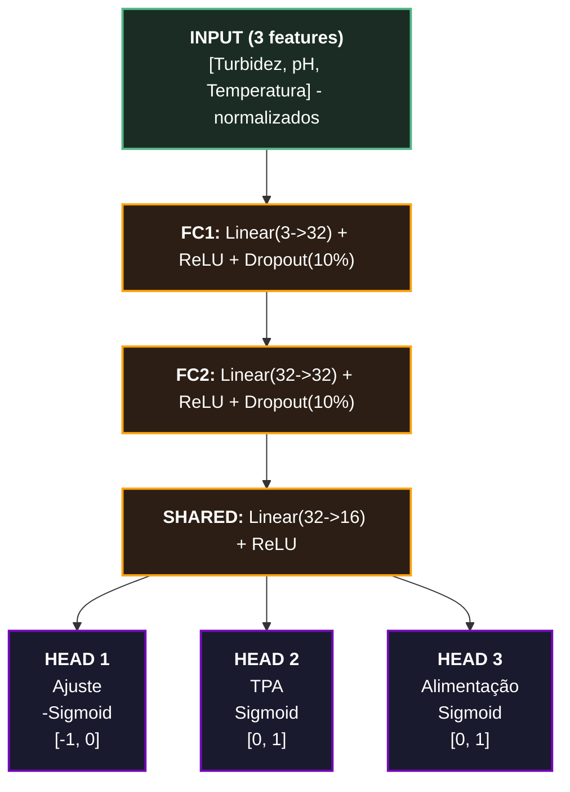
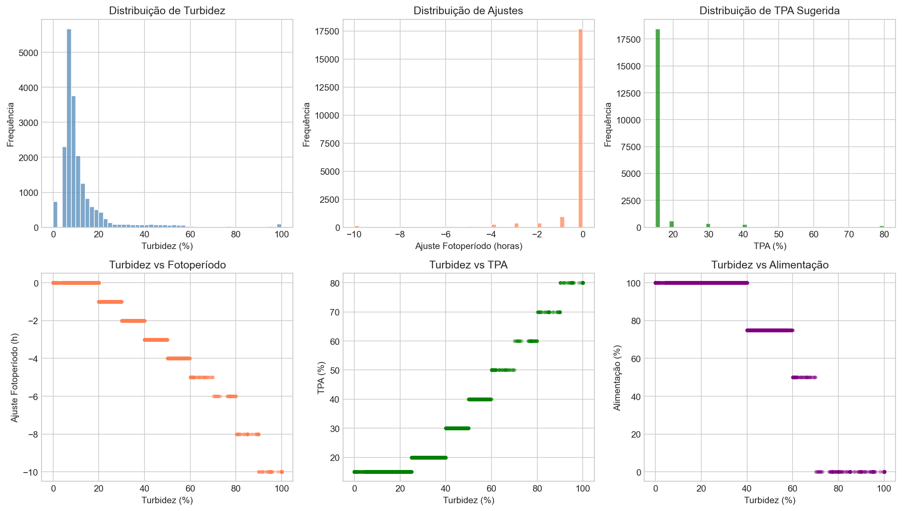
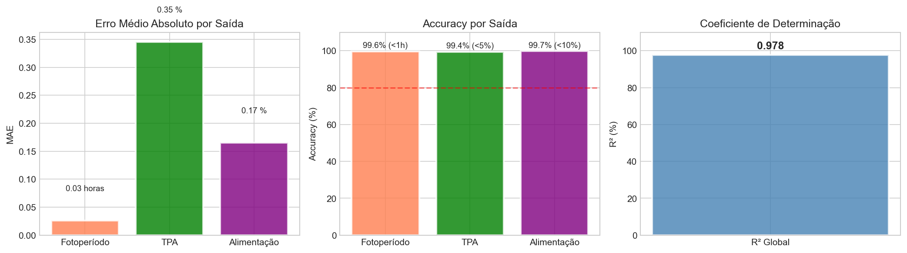
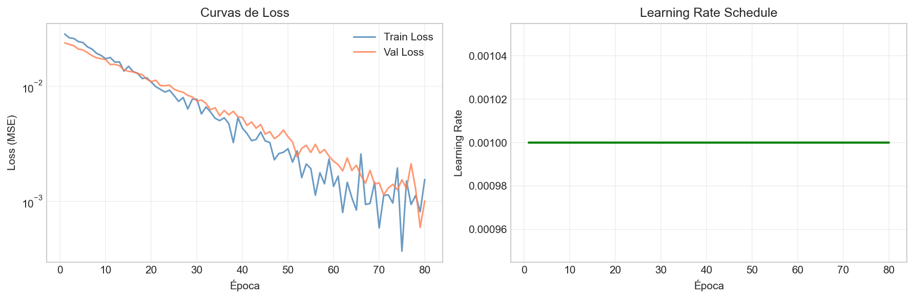
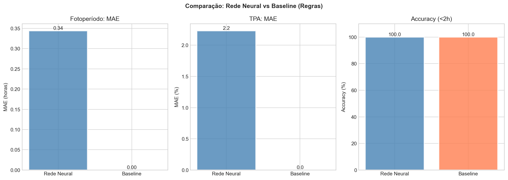

# AquaSense IA

Sistema de Inteligência Artificial para análise de parâmetros da água e geração de sugestões automáticas para controlo de iluminação, manutenção e alimentação de aquários.

## Objetivo

O sistema recolhe dados de sensores (turbidez, pH, temperatura) e produz recomendações operacionais com base num modelo de rede neural. O treino pode usar **dados reais da base de dados** ou **dados sintéticos** como fallback.

## Inputs do Modelo

| Parâmetro | Unidade | Range |
|-----------|---------|-------|
| Turbidez | % | 0 - 100 |
| pH | - | 6.0 - 8.5 |
| Temperatura | °C | 20 - 31 |

## Outputs do Modelo

| Parâmetro | Descrição |
|-----------|-----------|
| Ajuste Fotoperíodo | Horas a reduzir (0 a -12h) |
| TPA | Percentagem de troca de água (0-100%) |
| Alimentação | Percentagem da ração normal (0-100%) |

## Arquitetura



### Detalhes das Camadas

| Camada | Tipo | Entrada->Saída | Activação | Parâmetros |
| --- | --- | --- | --- | --- |
| fc1 | Linear | 3->32 | ReLU | 128 |
| dropout1 | Dropout(0.1) | 32->32 | \-  | 0   |
| fc2 | Linear | 32->32 | ReLU | 1,056 |
| dropout2 | Dropout(0.1) | 32->32 | \-  | 0   |
| shared | Linear | 32->16 | ReLU | 528 |
| head\_adj | Linear | 16->1 | \-Sigmoid | 17  |
| head\_tpa | Linear | 16->1 | Sigmoid | 17  |
| head\_feed | Linear | 16->1 | Sigmoid | 17  |
| **Total** |     |     |     | **1,763** |


- **Modelo**: AquaSenseNet (PyTorch)
- **Parâmetros**: 1763
- **Device**: CUDA/CPU

## Estrutura do Projeto

```
ai/
├── api_server.py          # API Flask para inferência
├── requirements.txt       # Dependências Python
├── README.md
│
├── models/
│   ├── photoperiod_model.pt   # Modelo treinado
│   ├── scaler.pkl             # Normalizador
│   └── metrics.json           # Métricas do treino
│
├── src/
│   ├── __init__.py
│   ├── config.py          # Configurações e regras
│   ├── model.py           # Arquitetura da rede
│   ├── data_loader.py     # Carregamento de dados (BD + sintético)
│   ├── train.py           # Script de treino
│   ├── inference.py       # Predição
│   ├── evaluate.py        # Avaliação
│   └── suggestions.py     # Geração de sugestões
│
└── notebooks/             # Jupyter notebooks (desenvolvimento)
    ├── treino_sintetico.ipynb
    └── treino_bd.ipynb
```

## Instalação

```bash
cd ai
pip install -r requirements.txt
```

Dependência extra para dados reais:
```bash
pip install mysql-connector-python
```

## Treino

### Treino Automático (BD com fallback sintético)

```bash
python3 -m src.train
```

O sistema tenta carregar dados da BD MySQL automaticamente. Se não houver dados suficientes (mínimo 100 amostras), usa dados sintéticos.

### Treino com Notebooks

```bash
jupyter notebook notebooks/
```

- `treino_sintetico.ipynb` - Treino com dados gerados
- `treino_bd.ipynb` - Treino com dados reais da BD

## Base de Dados

Configuração em `src/config.py` (suporta variáveis de ambiente para produção):

```python
DB_CONFIG = {
    "host": os.getenv("DB_HOST", "127.0.0.1"),
    "port": int(os.getenv("DB_PORT", "3309")),
    "user": os.getenv("DB_USER", "root"),
    "password": os.getenv("DB_PASSWORD", ""),
    "database": os.getenv("DB_NAME", "esp32_data"),
}
```

Tabela: `leituras_sensores`
- `tipo_sensor`: 'turbidity'/'turbidez', 'pH'/'ph', 'temperature'/'temperatura'
- `valor`: Valor numérico
- `data_hora`: Timestamp

**Nota:** O sistema aceita nomes de sensores em português ou inglês.

## API Server

```bash
python3 api_server.py
```

Servidor: http://localhost:5000

### Endpoints

| Método | Endpoint | Descrição |
|--------|----------|-----------|
| GET | `/api/ai/health` | Estado do servidor |
| GET | `/api/ai/photoperiod` | Predição com query params |
| POST | `/api/ai/predict` | Predição com JSON body |
| GET | `/api/ai/stats` | Estatísticas do modelo |

### Exemplo de Uso

```bash
curl "http://localhost:5000/api/ai/photoperiod?turbidity=30&ph=7.0&temperature=25"
```

```python
from src.inference import AquaSensePredictor

predictor = AquaSensePredictor()
resultado = predictor.predict(
    turbidity=30.0,
    ph=7.0,
    temperature=25.0,
    base_photoperiod=10
)
```

## Métricas (Último Treino)

| Métrica | Valor |
|---------|-------|
| R² | 0.978 |
| MAE Fotoperíodo | 0.03h |
| MAE TPA | 0.3% |
| MAE Alimentação | 0.2% |
| Accuracy Fotoperíodo (<1h) | 99.6% |
| Accuracy TPA (<5%) | 99.4% |
| Accuracy Alimentação (<10%) | 99.7% |

*Treinado com ~20k amostras reais da BD*

## Gerar Gráficos de Análise

```bash
python3 -m src.generate_plots
```

Gera 4 imagens na pasta `models/`:

### Distribuição dos Dados


### Métricas do Modelo


### Curvas de Treino


### Comparação NN vs Baseline


## Regras Base (Fallback)

O sistema também suporta predição baseada em regras definidas em `config.py`, útil quando o modelo não está disponível.

### Turbidez -> Ações

| Turbidez | Ajuste Foto | TPA | Alimentação |
|----------|-------------|-----|-------------|
| 0-20% | 0h | 15% | 100% |
| 20-40% | -1h a -3h | 20-30% | 100% |
| 40-60% | -3h a -5h | 30-50% | 50-75% |
| 60-80% | -5h a -8h | 50-70% | 0-50% |
| 80-100% | -8h a -10h | 70-80% | 0% |
